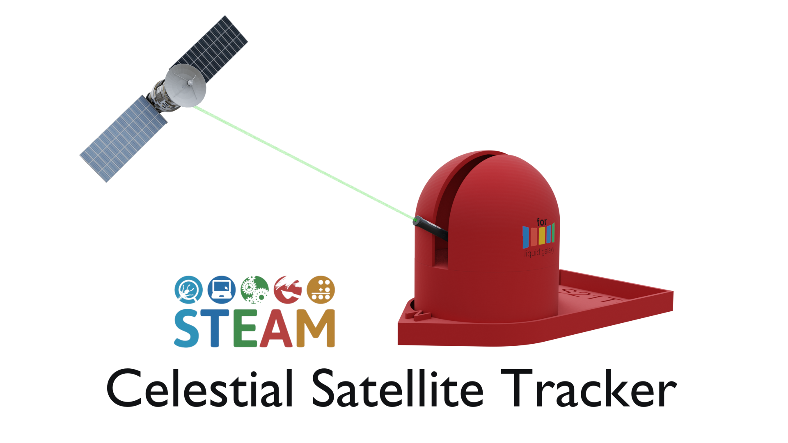

<p align="center">
  
</p>
<h1 align="center"> Steam Celestial Satellite tracker in real time</h1>

<p align="center">
  
  
  
  
</p>

### Summary

- [About](#about)
- [Building from source](#building-from-source)
- [Setting up the Arduino Controlled pointer](#setting-up-the-arduino-controlled-pointer)
- [Connecting to the Liquid Galaxy](#connecting-to-the-liquid-galaxy)
- [Contributing](#contributing)
- [Credits](#credits)
- [License](#license)

## About

This project represents the orbit of a satellite orbiting earth on an
Arduino-controlled pointer and a Liquid Galaxy rig through a mobile application. This project was developed within the Google Summer of Code 2023 program.

The application offers a unique way to visualize satellite orbits using the Liquid Galaxy rig (Google Earth) and a real-world Arduino-controlled pointer. It also provides insights into satellites' movements and access to vital satellite information seamlessly within the app.

Take a look at the app on the [Google Play Store](https://play.google.com/store/apps/details?id=com.savitore.steam_celestial_satellite_tracker_in_real_time&hl=en-IN).


 ### Main technologies and languages used

* Arduino UNO
* HC-05 Bluetooth module
* SG90 Servo motor
* C ++
* Dart

## Building from source

### Prerequisites

* Android Studio, Visual Studio Code or another IDE that supports Flutter development
* Flutter SDK
* Android SDK
* Git
* Arduino IDE
* Android device
* Components required for Andruino-controlled pointer

Read [this](https://flutter.dev/docs/get-started/install) documentation to know how to set up Flutter.

Then, clone the project:

```bash
$ git clone https://github.com/STEAM-Celestial-Satellite-tracker-in-real-time.git
$ cd STEAM-Celestial-Satellite-tracker-in-real-time
```

With the project cloned, open a terminal and navigate to the project root directory. 
First you need to install the packages by running:

```
flutter pub get
```

After successfully installing all the packages. You can run flutter doctor to check out the connected devices and if all the environment is correct.

```
flutter doctor
```

With everything ready to go, it is time to run the project.

> ❗ You must have a mobile device connected or an android emulator running in order to run the app.

```bash
$ flutter run --no-sound-null-safety
```

Once done, the APK file may be found into the `/build/app/outputs/flutter-apk/` directory, named `app-release.apk`.

## Setting up the Arduino-controlled pointer

You can find the documentation for setting up the Arduino-controlled pointer by clicking [here.](https://docs.google.com/document/d/1NfXiyhhtKBtD2GL_H1Qew8CYwpoZ0U3u9v3ifMiTAcE/edit)

Please note that the Arduino-controlled pointer is compatible only with Android devices that are running versions up to Android 11.

## Connecting to the Liquid Galaxy

If you have followed all the steps up to this point, your app should be running.

With the app open, click on the gear icon (⚙️) on the home page's top-right corner. When clicked, it will take you to the Settings page. On that page, select the LG Connection option.

To establish a connection with your Liquid Galaxy, enter the Liquid Galaxy host name, password, IP address, SSH connection port (change it only if the system's default SSH port 22 was changed), and the number of screens.

After completing the necessary steps, click on the `Connect` button. If the connection is successfully established, you will see a "Connected" label highlighted in green.

If the connection is successful, you are now all set to enjoy the app. Start exploring a variety of satellites and their related information.

## Contributing 

You're welcome to report any issues, bugs, or feature requests through our issue tracker. Kindly provide detailed and clear descriptions.

If you're interested in contributing to this project, feel free to submit a pull request.

## Credits

This app was made possible with the help of mentor Otávio J. França Oliveira, organization admin Andreu Ibáñez Perales, and testers from Liquid Galaxy LAB: Mohamed Zazou, Navdeep Singh, and Imad Laichi. 

Special thanks to Michell Algarra, the author of the SatNOGS project, and Sayed Nowroz, whose Arduino-controlled pointer served as inspiration.

## License

This software is licensed under the [MIT license](https://opensource.org/licenses/MIT).
